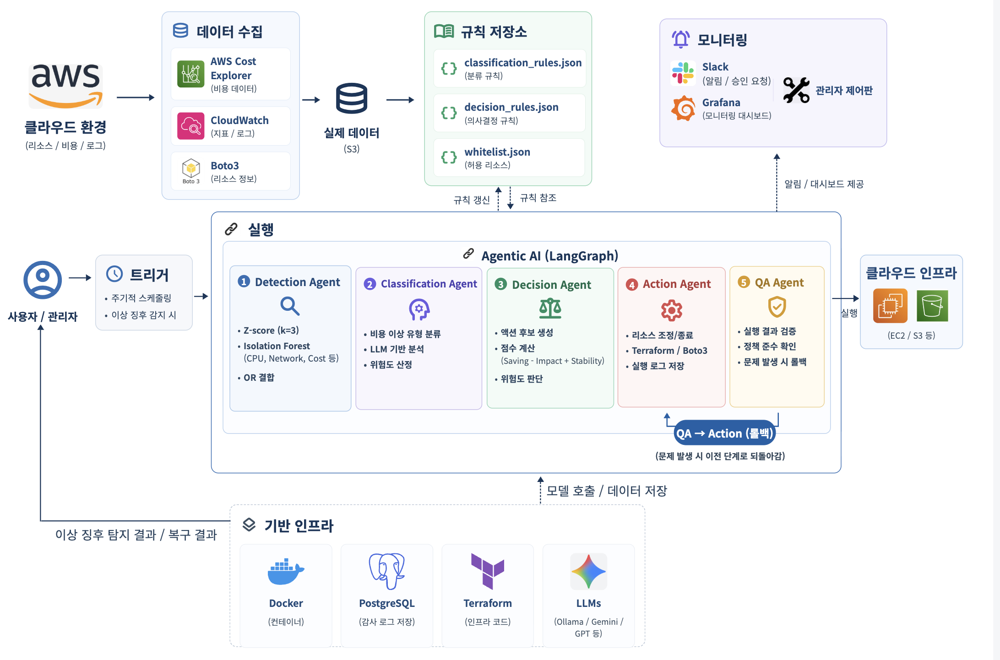

# Detection
### Agentic AI 기반 클라우드 비용 이상 징후 탐지 및 자율 복구 시스템

> 클라우드의 유연한 자원 확장은 비용 이상으로 이어질 수 있으며, 비용 낭비 및 비용 공격과 같은 비정상적인 비용 발생을 적시에 탐지하고 대응하는 것이 중요합니다. 본 연구에서는 LangGraph 기반 멀티에이전트 파이프라인을 구축하여 비용 이상 탐지부터 분류·판단·조치·검증까지의 과정을 자동화하였습니다. 또한 실제 AWS 리소스와 트래픽을 활용하여 시스템의 동작과 성능을 검증하였습니다.
>
> 그 결과, 주요 시나리오에서 평균 탐지 정확도 86.7%, Recall 85.7%(95% CI [69.7%, 95.2%])를 확인하였고, 전 단계를 곱한 전체 파이프라인 정확도는 평균 79.7%로 나타났습니다. 또한 EC2 오버프로비저닝 시나리오만을 운영규모가 큰 조직의 운영 규모로 환산했을 때 30일 기준 약 $763의 비용 절감 효과를 확인하였습니다.

---

## 목차
1. [프로젝트 배경](#1-프로젝트-배경)
2. [개발 목표](#2-개발-목표)
3. [시스템 설계](#3-시스템-설계)
4. [개발 결과](#4-개발-결과)
5. [설치 및 실행 방법](#5-설치-및-실행-방법)
6. [소개 자료 및 시연 영상](#6-소개-자료-및-시연-영상)
7. [팀 구성](#7-팀-구성)
8. [참고 문헌 및 출처](#8-참고-문헌-및-출처)

---

## 1. 프로젝트 배경

### 1.1 시장 현황 및 문제점

클라우드 서비스 시장은 매년 급격히 성장하고 있으며, 기업들의 클라우드 지출 규모도 함께 증가하고 있습니다. Flexera의 2026 State of the Cloud Report에 따르면, 기업들의 IaaS/PaaS 지출 중 약 29%가 실질적인 가치를 만들어내지 못하는 낭비성 지출로 조사되었습니다.[1]

이러한 비용 낭비를 방지하기 위해 **FinOps(Cloud Financial Operations)** 방법론이 등장했습니다. FinOps는 클라우드 비용을 실시간으로 모니터링하고 최적화하는 운영 프레임워크로, FinOps Foundation을 중심으로 빠르게 확산되고 있습니다.

그러나 현실적으로 **중소규모 기업은 FinOps 전담 인력을 두기 어렵습니다.** FinOps 엔지니어는 클라우드 아키텍처, 비용 분석, 자동화 스크립팅 등 다양한 역량을 필요로 하며, 전문 인력 채용에는 높은 비용이 수반됩니다. 결과적으로 많은 기업들이 비용 이상 징후를 사후에 발견하거나, 아예 인지하지 못한 채 불필요한 지출을 지속하게 됩니다.

### 1.2 필요성과 기대효과

#### 필요성

| 구분 | 기존 도구의 한계 | Detection 시스템의 해결 방안 |
|------|------------------|------------------------------|
| **AWS Cost Anomaly Detection** | 탐지만 제공, 복구는 수동 | 탐지부터 복구까지 자동화된 파이프라인 |
| **CloudHealth, Spot.io** | 월 단위 리포트 중심, 실시간성 부족 | 5분 단위 실시간 모니터링 및 즉각 대응 |
| **AWS Auto Scaling** | 사전 정의된 메트릭 기반, 비용 관점 부재 | 비용 이상 징후를 직접 탐지하고 비용 효율적 액션 선택 |
| **수동 모니터링** | 인력 의존, 휴먼 에러 발생 | AI 기반 24/7 자동 감시 및 일관된 판단 |

기존 FinOps 도구들은 대부분 **탐지(Detection)**에 집중하며, 실제 **복구(Remediation)**는 운영자가 직접 수행해야 합니다. 또한 AWS Auto Scaling은 CPU, 메모리 등 성능 메트릭 기반으로 동작하므로, **비용 이상(cost anomaly)**을 직접 다루지 않습니다.

#### 기대효과

- **비용 절감**: EC2 오버프로비저닝 사례 기준, 100대 규모 적용 시 30일 약 $763 절감 추정
- **운영 효율화**: MTTD(평균 탐지 시간) 0.204초, MTTR(평균 복구 시간) 약 313.7초
- **인력 부담 감소**: FinOps 전담 인력 없이도 비용 이상 징후 자동 대응 가능
- **리스크 관리**: Human-in-the-Loop(HITL) 승인 게이트로 고위험 액션 통제
- **24/7 대응**: 야간·주말에도 사람 개입 없이 이상 상황에 즉각 대응
- **AI 호출 비용 절감**: 반복되는 판단 패턴은 Rule Book 규칙으로 자동 승격하여 이후 LLM 호출 없이 처리
- **확장성 확보**: 다양한 클라우드 자원과 운영 환경에 유연하게 적용 가능

---

## 2. 개발 목표

### 2.1 목표

1. **실시간 비용 이상 징후 탐지**: CloudWatch 메트릭을 5분 단위로 수집하여 Isolation Forest, Z-score, 절대 임계값 기반으로 이상 탐지
2. **자동화된 복구 파이프라인**: 탐지된 이상에 대해 분류 → 의사결정 → 액션 실행 → 품질검증까지 자동 수행
3. **Human-in-the-Loop 지원**: 고위험 액션(리스크 MEDIUM 이상)에 대해 관리자 승인 게이트 적용
4. **확장 가능한 룰북 시스템**: JSON 기반 룰북으로 새로운 이상 유형과 대응 정책을 코드 변경 없이 추가
5. **실환경 검증**: 실제 AWS 리소스와 실제 트래픽을 활용한 실환경 검증

### 2.2 기존 서비스 대비 차별성 

| 특징 | 기존 솔루션 | Detection |
|------|-------------|-----------|
| **아키텍처** | 단일 모놀리식 또는 단순 룰 기반 | LangGraph 기반 6-에이전트 멀티에이전트 파이프라인 |
| **탐지 방식** | 단일 알고리즘 의존 | Isolation Forest + Z-score + 절대 임계값 앙상블 |
| **복구 범위** | 알림만 제공 또는 수동 복구 | 탐지부터 복구, QA까지 End-to-End 자동화 |
| **리스크 관리** | 없음 또는 전체 차단 | 리스크 레벨별 차등 승인 (LOW: 자동, MEDIUM+: HITL) |
| **확장성** | 하드코딩된 룰 | JSON 룰북 + 화이트리스트로 동적 정책 관리 |
| **비용 관점** | 성능 메트릭 중심 | 비용 메트릭 직접 모니터링 및 비용 효율적 액션 선택 |

### 2.3 사회적 가치

- **중소기업 클라우드 접근성 향상**: FinOps 전담 인력 없이도 엔터프라이즈급 비용 관리 가능
- **탄소 발자국 감소**: 유휴 리소스(좀비 인스턴스 등) 자동 정리로 불필요한 컴퓨팅 자원 소비 감소
- **운영 인력의 고부가가치 업무 집중**: 반복적인 비용 모니터링을 자동화하여 인력을 혁신 업무에 재배치

---

## 3. 시스템 설계

### 3.1 시스템 구성도



**파이프라인 흐름**:
1. **Detection Agent**: CloudWatch에서 메트릭 수집 → Isolation Forest/Z-score/절대 임계값으로 이상 탐지
2. **Classification Agent**: Rule Book 우선 매칭, 안 걸리면 LLM(Gemini)으로 이상 유형(`cost_inefficiency`/`cost_spike`/`risk_security`) 분류
3. **Decision Agent**: 룰북 조회 → 리스크 레벨에 따라 액션 선택 및 승인 게이트 결정
4. **Action Agent**: boto3로 AWS API 호출하여 복구 액션 실행 (Stop, Resize, Throttle, Block, ScaleDown+WAF 등)
5. **QA Agent**: 액션 실행 300초 후 재조회하여 상태 검증 (실제로 중지되었는지, 스로틀링이 적용되었는지 등), 실패 시 롤백
6. **Logging Agent**: 전체 흐름을 PostgreSQL에 기록, Grafana 대시보드로 시각화

세부 판단 로직과 각 단계의 근거는 [4.1 전체 시스템 흐름도](#41-전체-시스템-흐름도)에서 자세히 다룹니다.

### 3.2 사용 기술

| 분류 | 기술 | 버전 | 용도 |
|------|------|------|------|
| **Core Framework** | LangGraph | 1.1.10 | 멀티에이전트 오케스트레이션 |
| **LLM** | Google Gemini | gemini-2.5-flash | 이상 유형 분류 및 의사결정 |
| **ML** | scikit-learn | 1.7.2 | Isolation Forest 이상 탐지 |
| **Cloud SDK** | boto3 | 1.43.3 | AWS API 연동 |
| **Backend** | FastAPI | 0.115.6 | REST API 서버 |
| **Frontend** | React (Vite) | 18.3.1 | 관리자 대시보드 |
| **Database** | PostgreSQL | 16 | 로그 및 상태 저장 |
| **Monitoring** | Grafana | 11.4.0 | 메트릭 시각화 |
| **Language** | Python | 3.10 | 백엔드 개발 |

#### 기술 선정 근거

- **에이전트 오케스트레이션: LangGraph**
  - 롤백 사이클, 승인 대기 같은 복잡한 실행 흐름을 간결하게 구현 가능
  - 순수 Python 대비 동일 기능 코드량 약 68.8% 절감
- **LLM: Gemini**
  - 무료 티어로 대량 LLM 호출 비용 절감
- **학습 모델: IsolationForest**
  - 사전 레이블 확보가 어려운 클라우드 운영 환경 특성상, 레이블 없이도 다변량 지표에서 이상 패턴 탐지 가능한 비지도학습
  - 거리가 먼 점이 아니라 고립시키기 쉬운 점으로 이상치를 정의 → 계산복잡도가 선형에 가까움
  - 레이블 없이도 CPU/네트워크/비용 등 여러 지표를 동시에 고려하는 다변량 판정 가능 → 단일 지표만 보는 Z-score의 한계 보완
- **Z-score**
  - 계산 단순, 해석 직관적
  - 단점은 IForest와 앙상블로 상호 보완
- **DB: PostgreSQL**
  - 새 리소스 유형 추가 확장성
  - JSONB로 리소스별 상이한 데이터를 유연하게 저장
- **시각화: Grafana**
  - PostgreSQL 네이티브 연동
  - 오픈소스라 비용 부담 적음

---

## 4. 개발 결과

### 4.1 전체 시스템 흐름도

```
사용자 요청 / 스케줄러 트리거
            │
            ▼
    ┌───────────────┐
    │ Detection Agent│  ← CloudWatch 메트릭 수집 (5분 윈도우)
    │ - Isolation Forest
    │ - Z-score
    │ - 절대 임계값
    └───────┬───────┘
            │ anomaly_flag = True
            ▼
    ┌───────────────┐
    │Classification │  ← Rule Book 우선 매칭, 안 걸리면 LLM(Gemini)
    │    Agent      │
    └───────┬───────┘
            │ anomaly_type (cost_inefficiency / cost_spike / risk_security)
            ▼
    ┌───────────────┐
    │ Decision Agent│  ← 룰북 조회, 리스크 평가
    └───────┬───────┘
            │
    ┌───────┴───────┐
    │ Risk Level?   │
    ├───────────────┤
    │ LOW           │──→ 자동 실행
    │ MEDIUM/HIGH   │──→ 승인 게이트 (HITL)
    └───────────────┘
            │
            ▼
    ┌───────────────┐
    │  Action Agent │  ← boto3로 AWS API 호출
    │ - EC2 Stop/Resize
    │ - Lambda Throttle
    │ - S3 Block
    │ - AutoScaling ScaleDown + WAF Rate Rule
    └───────┬───────┘
            │
            ▼
    ┌───────────────┐
    │    QA Agent   │  ← 300초 대기 후 재조회, 결과 검증
    └───────┬───────┘
            │
            ▼
    ┌───────────────┐
    │ Logging Agent │  ← PostgreSQL 기록
    └───────────────┘
```

#### 파이프라인 각 에이전트

1. **Detection**
   - **사용한 모델**: Z-score(지속성 체크) + IForest(다변량, SHAP 설명) 앙상블 + EC2 전용 절대임계값 게이트 (좀비/오버프로비저닝은 통계 탐지가 약해서 별도 유지)
   - **하이퍼파라미터**: 이상이다/아니다를 가르는 기준값 2개(IForest 민감도, Z-score 민감도)를 여러 조합으로 다 테스트해봐서 제일 나은 값을 찾음
   - **학습데이터**: z-score와 IForest 모델 판정 둘 다 정상 범위인 데이터만 골라서 학습시킴. 초기에는 미리 만들어둔 안정적인 학습 데이터로 모델을 고정해서 쓰고, 실제 운영 데이터가 쌓이면 이 고정을 풀고 자동으로 계속 학습하게 만들어둠
2. **Classification**: Rule Book 우선 매칭(우선순위 낮은 숫자 먼저) → 못 걸리면 Gemini LLM 폴백
3. **Decision**: Rule Book 우선 매칭(우선순위 낮은 숫자 먼저) → 못 걸리면 Gemini LLM 폴백
4. **Approval Gate**: 위험도 LOW는 자동 진행, MED/HIGH는 사람 승인 필요
5. **Action**: boto3로 실제 조치 (실행 전 스냅샷 저장)
6. **QA**: 300초 대기 후 재조회 → 탐지 당시 이상 지표 재측정 → 지표 + 비용 증가 여부 + 액션 성공 여부(가용성) 3가지를 재검증 → 실패 시 스냅샷으로 롤백 (최대 2회 재시도)

### 4.2 기능 설명 및 주요 기능 명세서

#### 지원 이상 유형 및 대응 액션

| 시나리오 | 리소스 | 탐지 조건 | anomaly_type | 대응 액션 | 리스크 |
|-----------|--------|-----------|-----------|-----------|--------|
| **EC2 좀비** | EC2 | 비용만 단독 이상 + peak CPU ≤ 5% | cost_inefficiency | Stop | LOW (자동) |
| **EC2 오버프로비저닝** | EC2 | 비용만 단독 이상 + 5% < peak CPU ≤ 20% | cost_inefficiency | Resize (한 단계 낮은 타입으로) | MEDIUM (승인 필요) |
| **Lambda 재시도/스로틀 폭증** | Lambda | throttle_count 단독 급증 또는 invocation_count+error_count 동시 급증 | cost_spike | Throttle (동시성 제한) | MEDIUM (승인 필요) |
| **S3 대량 다운로드** | S3 | bytes_downloaded 단독 급증 | risk_security | Block (퍼블릭 접근 차단) | HIGH (승인 필요) |
| **AutoScaling EDoS** | AutoScaling | request_count 평균 대비 2배↑ + 최근 구간 60%↑ 유지 | risk_security | ScaleDown + WAF Rate-based Rule (트래픽 차단) | HIGH (승인 필요) |

#### 실연동 검증 방법

각 시나리오는 실제 AWS 리소스를 새로 띄우고, 실제 트래픽·부하를 직접 발생시켜 진짜 CloudWatch 지표로 탐지~조치~검증까지 실측하였습니다.

- **EC2**: 부팅 시 자동 실행되는 User Data 스크립트로 CPU 부하 루프 실행 (systemd-run으로 백그라운드 유지)
- **Lambda**: `boto3`의 `lambda_client.invoke()`를 `ThreadPoolExecutor`로 동시에 대량 호출
- **S3**: `boto3`의 `s3_client.get_object()`를 `ThreadPoolExecutor`로 동시에 대량 호출
- **AutoScaling(EDoS)**: `requests` 라이브러리로 ALB에 실제 HTTP GET 요청을 `ThreadPoolExecutor`로 동시에 반복 전송

### 4.3 결과 수치

#### 탐지 모델 성능

각 시나리오별로 정상 케이스와 이상 케이스를 반복 실험하여 통계적 신뢰 구간(95% CI, Clopper-Pearson)을 산출하였습니다.

| 시나리오 | 정상/이상 샘플 | 정확도 [95% CI] | 재현율 [95% CI] | 위양성률(FPR) [95% CI] |
|----------|---------------|-----------------|-----------------|------------------------|
| **EC2 좀비** | 8 / 5 | 100.0% [75.3%, 100%] | 100.0% [47.8%, 100%] | 0.0% [0%, 36.9%] |
| **EC2 오버프로비저닝** | 8 / 5 | 100.0% [75.3%, 100%] | 100.0% [47.8%, 100%] | 0.0% [0%, 36.9%] |
| **Lambda 스로틀 재시도 폭증** | 8 / 5 | 76.9% [46.2%, 95.0%] | 100.0% [47.8%, 100%] | 37.5% [8.5%, 75.5%]* |
| **S3 대량 다운로드** | 8 / 5 | 92.3% [64.0%, 99.8%] | 100.0% [47.8%, 100%] | 12.5% [0.3%, 52.7%] |
| **AutoScaling EDoS** | 8 / 15 | 73.9% [51.6%, 89.8%] | 66.7% [38.4%, 88.2%] | 12.5% [0.3%, 52.7%] |

> \* Lambda 시나리오의 높은 FPR은 스로틀링 메트릭의 민감도로 인한 것으로, 임계값 조정을 통해 개선 가능합니다.

**분석 요약**:
- **EC2 좀비/오버프로비저닝**: 고정 임계값 기반 탐지로 정확도·재현율 100% (다만 표본이 임계값 경계에서 충분히 검증되지 않아 일반화에는 주의 필요)
- **S3 대량 다운로드**: 92.3% 정확도, 재현율 100%로 높은 신뢰성
- **Lambda 재시도 폭증**: 재현율 100%이나 FPR 37.5%로 위양성 존재
- **AutoScaling EDoS**: 가장 많은 표본(n=23)으로 검증, 재현율 66.7%로 통계 기반 탐지의 실질적 성능을 보여줌

#### 정확도

- **평균 탐지 정확도**: 88.6%(단순평균) / 86.7%(표본수 가중평균)
- **평균 Recall**: 85.7% (95% CI [69.7%, 95.2%])
- **전체 파이프라인 정확도**(탐지×분류×결정×실행×QA): 79.7%

#### 파이프라인 소요 시간

- **MTTD**(평균 탐지 소요시간): 0.204초
- **MTTR**(평균 복구 소요시간): 313.7초(평균) / 302.3초(중앙값)

#### 비용 절감액

- EC2 Resize 사례 0.0106 USD/hr/인스턴스 → 30일 환산 $7.63
- → 100대 규모 적용 시 월 약 $763 절감 추정

### 4.4 디렉토리 구조

```
langgraph_study/
├── api/                    # FastAPI 백엔드
│   ├── main.py             # API 엔트리포인트
│   ├── routers/            # API 라우터 (approvals, status, logs 등)
│   └── schemas.py          # Pydantic 스키마
├── pipeline/                # 에이전트 파이프라인
│   ├── detection_agent.py
│   ├── classification_agent.py
│   ├── decision_agent.py
│   ├── action_agent.py
│   ├── QA_agent.py
│   ├── logging_agent.py
│   ├── rule_engine.py       # Rule Book 매칭 엔진
│   └── graph.py             # LangGraph 그래프 정의
├── schema/                  # 룰북 및 상태 스키마
│   ├── rule_book.py
│   ├── rules/                # JSON 룰 정의 (classification/decision/qa)
│   └── state.py              # PipelineState 정의
├── models/                  # ML 모델 캐시
├── frontend/                 # React 프론트엔드
│   └── src/
│       ├── components/       # React 컴포넌트
│       └── api.js            # API 클라이언트
├── playground/                # 실험 및 평가 스크립트, real_demo/live_demo
└── config/                    # 환경 설정
```

### 4.5 산업체 멘토링 의견 및 반영 사항

본 프로젝트는 부산대학교 정보컴퓨터공학부 졸업과제로 수행되었으며, 다음의 지도를 받았습니다.

- **지도교수**: 부산대학교 정보컴퓨터공학부 김태운 교수
- **산업체 멘토**: 클라우드 인프라 및 FinOps 분야 실무 자문
    - **기존 도구와의 차별점 명확화**: 중간보고서 발표 후 "기존 FinOps 도구들과 구체적으로 무엇이 다른가"라는 의견을 받아, AWS Cost Anomaly Detection·CloudHealth·Auto Scaling 등 기존 도구와 비교해 (1) 이상 유형 세분화 분류, (2) 탐지부터 조치·검증까지의 자동화 통합, (3) 승인 게이트 및 우선순위 조정 기능이라는 3가지 차별점을 서론에 구체적으로 추가하였습니다.
    - **정량적 검증 강화**: "성능 검증이 정성적 확인에 그친다"는 의견을 받아, 라벨링된 실측 데이터를 기반으로 정확도·재현율·F1-score 등 정량 지표와 Clopper-Pearson 신뢰구간을 산출하여 결과 분석을 보강하였습니다.
    - **EC2 Resize 절감액 계산 정확도 개선**: 기존에는 평균 비용을 단가표와 비교해 인스턴스 타입을 역추정하는 방식이었는데, 비용이 유사한 타입 간에는 부정확할 수 있다는 의견을 받아, AWS API로 실제 인스턴스 타입을 직접 조회해 절감액을 계산하도록 수정하였습니다.

### 4.6 향후 과제

- **표본 수 확대**: 테스트 반복 횟수를 늘리고 장기간 반복 검증하여 통계적 신뢰성을 강화합니다.
- **실제 운영 환경 검증**: 클라우드를 실제로 운영 중인 회사에 적용해서 검증합니다.
- **EDoS 공격 패턴 다양화**: 다양한 공격 패턴을 직접 생성해서 탐지 성능을 검증합니다.
- **동시 접근 안정성 보완**: 여러 프로세스가 동시에 모델에 접근할 때의 안정성을 보완합니다.
- **모델 오염 방지**: 운영 중 실측 데이터가 학습 버퍼에 잘못 반영되어 모델이 오염될 수 있는 문제를 보완합니다.

---

## 5. 설치 및 실행 방법

### 사전 요구사항

- Python 3.10+
- Node.js 18+
- Docker / Docker Compose (PostgreSQL, Grafana 실행용)
- AWS 계정 및 자격 증명

### 설치 

```bash
# 저장소 클론
git clone https://github.com/PNU-Detection/finops-auto-recovery.git
cd finops-auto-recovery

# 가상환경 생성 및 활성화
python -m venv .venv
source .venv/bin/activate  # Windows: .venv\Scripts\activate

# 백엔드 의존성 설치
pip install -r requirements.txt

# 프론트엔드 의존성 설치
cd frontend && npm install && cd ..

# 환경 변수 설정
cp .env.example .env
# .env 파일에 AWS 자격 증명, Gemini API 키, DB 연결 정보 입력
# (SLACK_WEBHOOK_URL은 선택)
```

### 실행 순서 (의존성 순서대로)

**1) DB ** 
```bash
docker compose up -d postgres
```

**2) Grafana** 
```bash
docker compose up -d grafana
```
→ 접속: http://localhost:3001 (admin / admin)

**3) 백엔드** 
```bash
python -m api.main
```
→ 접속: http://localhost:8000

**4) 프론트엔드**
```bash
cd frontend
npm run dev
```
→ 접속: http://localhost:3000 (admin1 / admin1)

### 한 번에 실행 (Windows)

```powershell
PowerShell -ExecutionPolicy Bypass -File start.ps1
```
백엔드/프론트엔드를 각각 새 창으로 자동 실행합니다. (Postgres/Grafana는 미리 떠있어야 함)

**의존성 요약**: `Postgres` → `Grafana`, `백엔드` → `프론트엔드`

---

## 6. 소개 자료 및 시연 영상

- **발표 자료**: [2026전기 최종발표 PPT](docs/2026전기_27_Detection_ppt.pdf)
- **시연 영상**: [YouTube 링크](https://youtu.be/Azj146SFHJM?si=KHH0drJV2E6j-fyP)

---

## 7. 팀 구성

| 학번 | 이름 | 역할 | 주요 담당 영역 |
|------|------|------|---------------|
| 202355514 | **강지원** | Backend / DevOps | Rule Book 설계 및 자동 승격 로직 구현, QA 판정 및 롤백 조건 구현, WAF 등 인바운드 보안 조치 핸들러 구현, AutoScaling EDoS 반복실험 |
| 202355540 | **박소영** | ML / Backend | 이상 탐지 모델 구현 (Isolation Forest / Z-score), 로깅 및 DB 적재, Grafana 대시보드 구축, EC2 좀비 · Lambda 재시도 폭증 반복실험 |
| 202355594 | **허소영** | Frontend / LLM | 규칙 · LLM 기반 판단 로직 구현, 리소스별 조치 실행 구현, 관리자 웹 제어판 및 Slack 알림 구현, EC2 오버프로비저닝 · S3 다운로드 폭증 · EDoS 반복실험 |

**소속**: 부산대학교 정보컴퓨터공학부

---

## 8. 참고 문헌 및 출처

1. Flexera. (2026). *State of the Cloud Report*. https://info.flexera.com/CM-REPORT-State-of-the-Cloud
2. Flexera. (2026). *New Flexera Report Finds that 84% of Organizations Struggle to Manage Cloud Spend*. https://www.flexera.com/about-us/press-center/new-flexera-report-finds-84-percent-of-organizations-struggle-to-manage-cloud-spend
3. FinOps Foundation. *The FinOps Framework*. https://www.finops.org/framework/
4. Liu, F. T., Ting, K. M., & Zhou, Z. H. (2008). *Isolation Forest*. IEEE International Conference on Data Mining.
5. Lundberg, S. M., & Lee, S.-I. (2017). *A Unified Approach to Interpreting Model Predictions*. NeurIPS.
6. Clopper, C. J., & Pearson, E. S. (1934). *The Use of Confidence or Fiducial Limits Illustrated in the Case of the Binomial*. Biometrika.
7. LangChain, Inc. *LangGraph Documentation - Persistence*. https://langchain-ai.github.io/langgraph/concepts/persistence/
8. LangChain, Inc. *LangGraph Documentation - Human-in-the-loop*. https://langchain-ai.github.io/langgraph/concepts/human_in_the_loop/
9. Amazon Web Services. *Boto3 Documentation*. https://boto3.amazonaws.com/v1/documentation/api/latest/index.html
